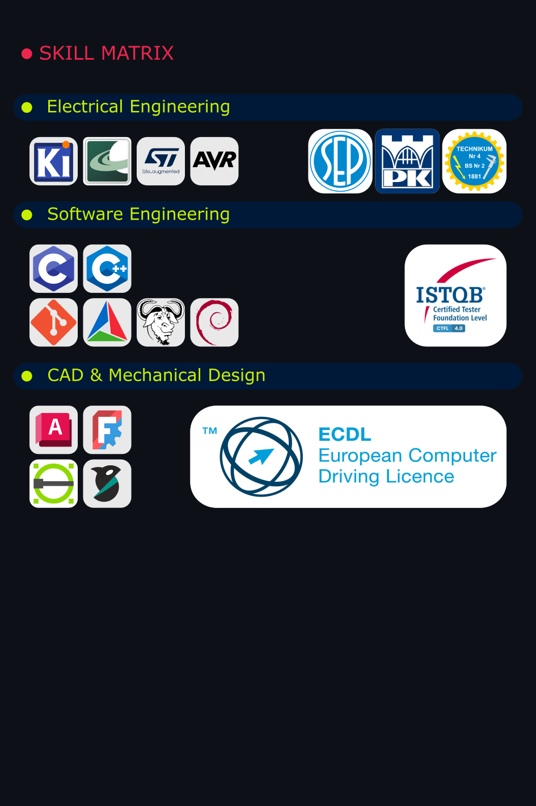
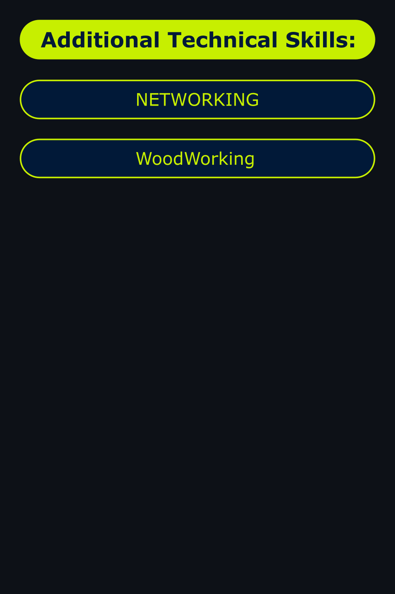

<map name="mapa">
    <!-- Pole 1 -->
    <area shape="rect" coords="X1,Y1,X2,Y2" href="https://link1.com" alt="link1">
    <!-- Pole 2 -->
    <area shape="rect" coords="A1,B1,A2,B2" href="https://link2.com" alt="link2">
</map>

<map name="mapa">
    <!-- Pole 1 -->
    <area shape="rect" coords="X1,Y1,X2,Y2" href="https://link1.com" alt="link1">
    <!-- Pole 2 -->
    <area shape="rect" coords="A1,B1,A2,B2" href="https://link2.com" alt="link2">
</map>

<map name="mapa">
    <!-- Pole 1 -->
    <area shape="rect" coords="X1,Y1,X2,Y2" href="https://link1.com" alt="link1">
    <!-- Pole 2 -->
    <area shape="rect" coords="A1,B1,A2,B2" href="https://link2.com" alt="link2">
</map>

<map name="mapa">
    <!-- Pole 1 -->
    <area shape="rect" coords="X1,Y1,X2,Y2" href="https://link1.com" alt="link1">
    <!-- Pole 2 -->
    <area shape="rect" coords="A1,B1,A2,B2" href="https://link2.com" alt="link2">
</map>

<h1 align="center" style="font-size:48px; font-weight:900; 
  color:#0ff; text-shadow:0 0 10px #0ff, 0 0 20px #08f, 0 0 40px #0ff;">
🟣🟣🟣🟣🟣🟣🟣🟣
</h1>

<h1 align="center" style="font-size:48px; font-weight:900; 
  color:#0ff; text-shadow:0 0 10px #0ff, 0 0 20px #08f, 0 0 40px #0ff;">
BHOPAL SYSTEM / C++ • ASIO • SERIAL • SFML 
</h1>

<h1 align="center" style="font-size:48px; font-weight:900; 
  color:#0ff; text-shadow:0 0 10px #0ff, 0 0 20px #08f, 0 0 40px #0ff;">
🟣🟣🟣🟣🟣🟣🟣🟣
</h1>

  NEURAL DATA STREAM • REAL-TIME PARSING • LOW-LATENCY IO

  
  
  
  
  

  
  
  

## 🧬 CyberStack
- C++20 / Boost.Asio — zero-latency IO, async pipelines  
- SFML — render core + audio feedback  
- Serial / UART / COM — data ingestion modules  
- CMake — multi-module build grids  
- Python — auxiliary processing & neural pre-formatting  
- Linux — system backbone, daemons, SMB3, OMV  
